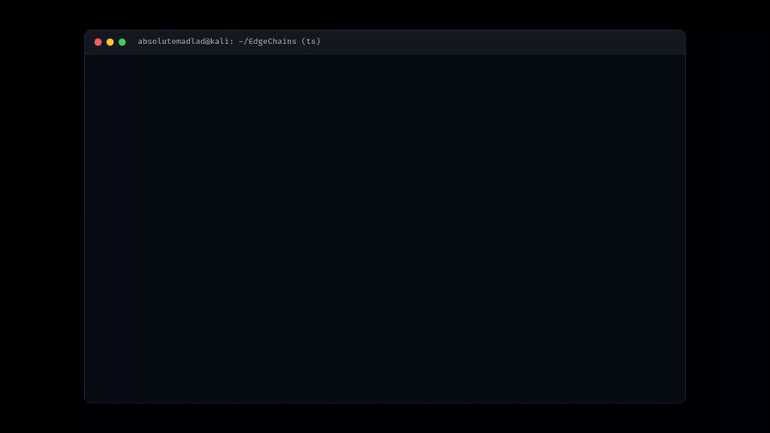

# AWS Comprehend PII Redaction & Observable Chaining Example

This example demonstrates how to integrate **Amazon Comprehend** into EdgeChains to detect and redact sensitive Personally Identifiable Information (PII) before prompts reach LLM endpoints, utilizing both Promise-based and cold RxJS **Observable** flows.



## Features Demonstrated

1. **Deterministic PII Redaction (`AwsComprehendRedactor`)**:
   - Replaces PII entities (Names, Emails, SSNs, Phone Numbers, Addresses, Credit Cards, etc.) with configurable masks (e.g. `[NAME]`, `[SSN]`, `[REDACTED]`, or custom callback).
   - Descending offset slicing to guarantee safe string replacement without index drift.
   - Threshold confidence filtering and entity type allowlist/blocklists.
   - Fail-closed mode to prevent unredacted data leakage if detection fails.

2. **Reactive RxJS Chaining (`redactPiiOperator`)**:
   - Custom RxJS operator to seamlessly pipe and sanitize prompts in reactive event streams.

3. **Endpoint Chaining (`AwsComprehendRedactionChain`)**:
   - Chained directly with EdgeChains endpoints (`OpenAI`, `GeminiAI`, `LlamaAI`).
   - Supports both `.chat()` (Promise) and `.chat$()` (Observable) interfaces.

---

## Quick Start

### 1. Install Dependencies
```bash
npm install
```

### 2. (Optional) Configure Live AWS Credentials
Create a `.env` file in this directory if you want to use live Amazon Comprehend:
```env
AWS_REGION=us-east-1
AWS_ACCESS_KEY_ID=your_access_key
AWS_SECRET_ACCESS_KEY=your_secret_key
```

*Note: If no AWS credentials are configured, the example automatically runs in **Offline/Mock Demonstration Mode** so that you can test and record the demo immediately without incurring AWS costs.*

### 3. Run the Demo
```bash
npm start
```

---

## Running Unit Tests
To verify all test cases across the EdgeChains SDK:
```bash
cd ../../arakoodev
npx vitest run src/ai/src/tests/awsComprehendRedaction.test.ts
```

---

## Recording Your Demo Video (Loom)
For bounty submission on GitHub / Algora:
1. Open [Loom](https://www.loom.com).
2. Record your terminal while running:
   ```bash
   # Show unit test suite passing
   cd JS/edgechains/arakoodev && npx vitest run src/ai/src/tests/awsComprehendRedaction.test.ts
   
   # Show the example demo executing
   cd ../examples/comprehend-redaction && npm start
   ```
3. Highlight the redacted output (`[NAME]`, `[SSN]`, `[EMAIL]`), the RxJS observable operator in action, and the sanitized prompt received by the chained LLM endpoint.
